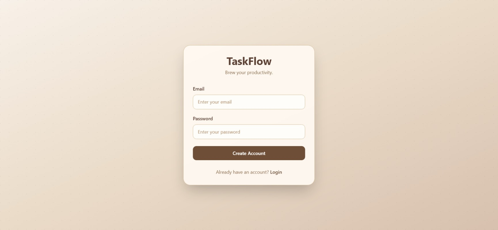
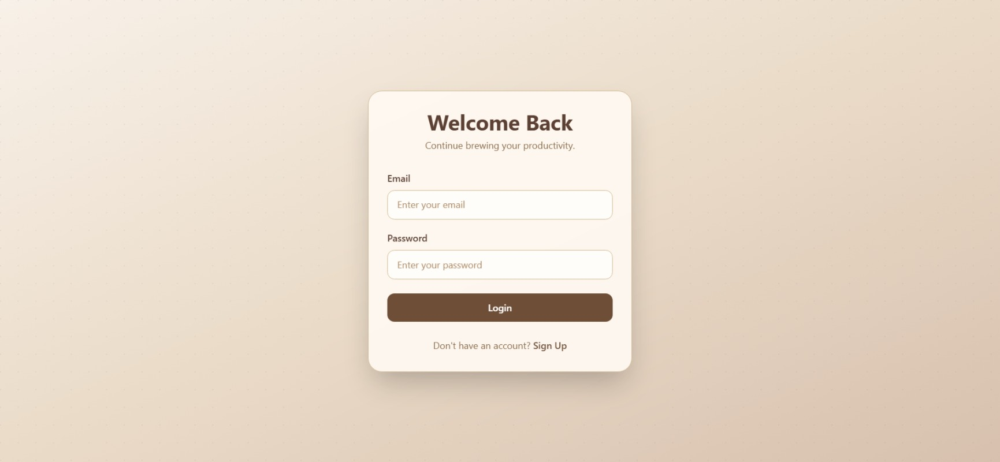
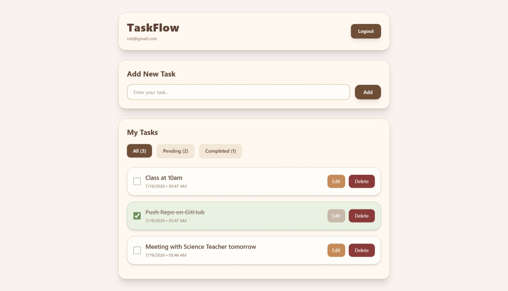

# TaskFlow

TaskFlow is a simple and responsive Todo application built with React, Vite, Firebase Authentication, and Cloud Firestore. It allows users to create an account, securely log in, and manage their personal tasks with full CRUD functionality.

## Features

- User Authentication with Firebase
- Secure Signup and Login
- Protected Routes
- Add New Tasks
- Edit Existing Tasks
- Delete Tasks
- Mark Tasks as Completed
- Filter Tasks (All, Pending, Completed)
- User-specific task storage
- Responsive UI
- Coffee-inspired custom theme

## Tech Stack

- React
- Vite
- React Router DOM
- Firebase Authentication
- Cloud Firestore
- Tailwind CSS

## Screenshots

### Signup Page



### Login Page



### Home Page



## Project Structure

```
src
│
├── component
│   ├── EditModal.jsx
│   └── TodoCard.jsx
│
├── context
│   └── AuthContext.jsx
│
├── pages
│   ├── Login.jsx
│   ├── Signup.jsx
│   └── Home.jsx
│
├── firebase.js
├── App.jsx
└── main.jsx
```

## Installation

Clone the repository.

```bash
git clone https://github.com/Areej39/taskflow.git
```

Move into the project directory.

```bash
cd taskflow
```

Install dependencies.

```bash
npm install
```

Start the development server.

```bash
npm run dev
```

## Firebase Configuration

Create a Firebase project and enable:

- Firebase Authentication (Email/Password)
- Cloud Firestore Database

Create a `firebase.js` file and add your Firebase configuration.

## Learning Outcomes

This project helped me understand:

- React Hooks
- React Router
- Context API
- Firebase Authentication
- Authentication State Management
- Cloud Firestore CRUD Operations
- Protected Routes
- Component-Based Architecture
- Responsive UI Design with Tailwind CSS

## Future Improvements

- Forgot Password
- Email Verification
- Update Email
- Update Password
- Delete Account
- Real-time Firestore updates using `onSnapshot`
- Toast notifications
- Search tasks
- Task categories

## Author

**Areej Fatima**

GitHub: https://github.com/Areej39

Live Demo: https://task-flow-theta-sandy.vercel.app/
